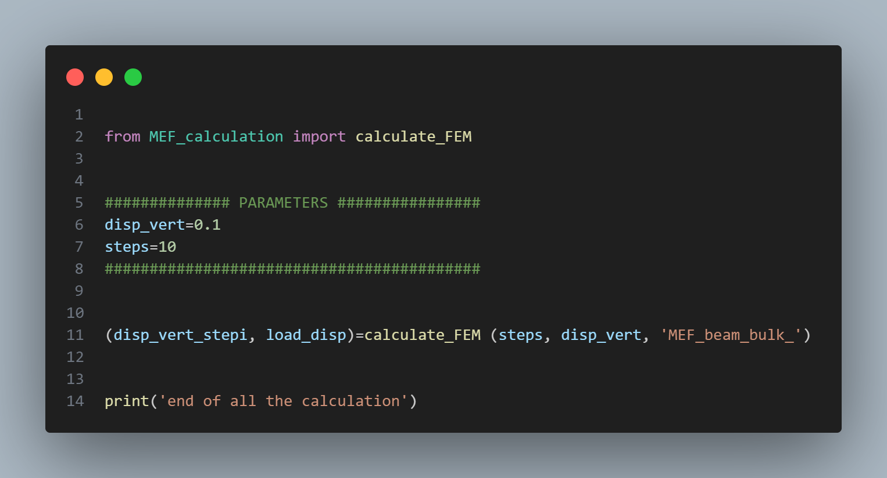
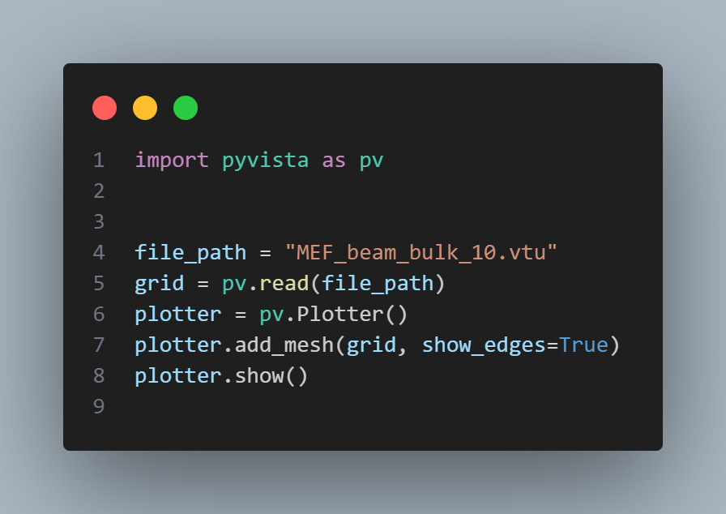
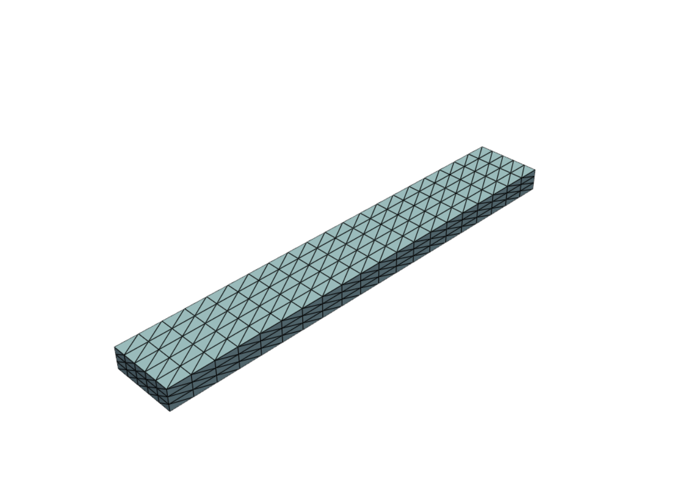
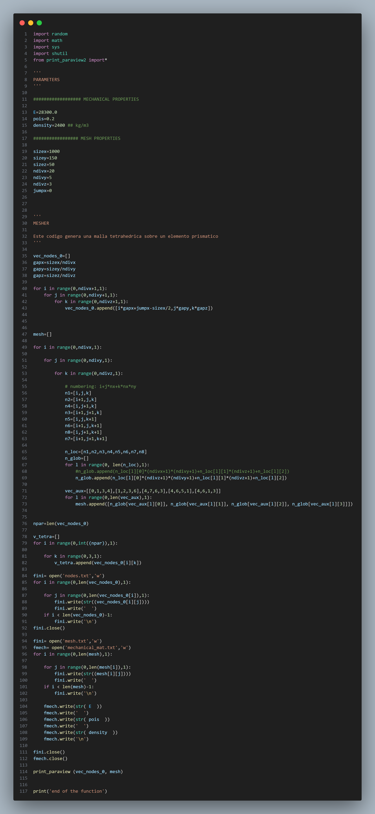
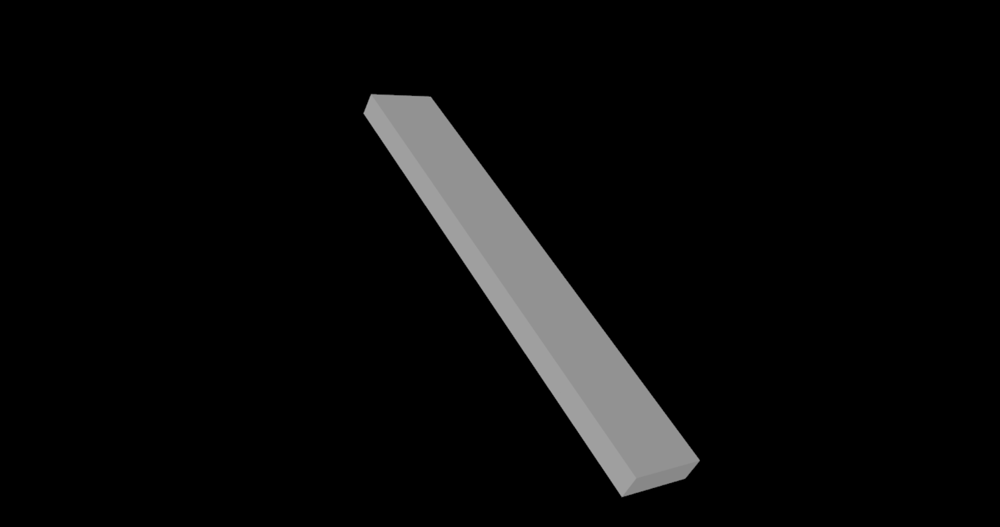
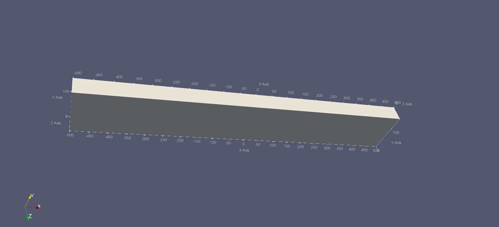
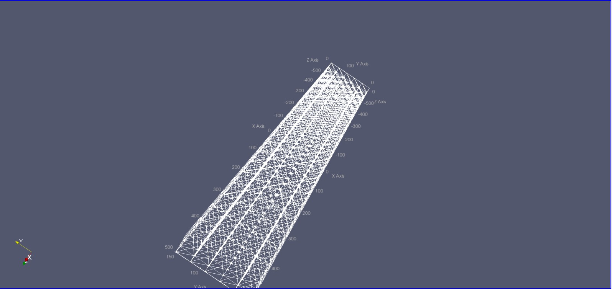
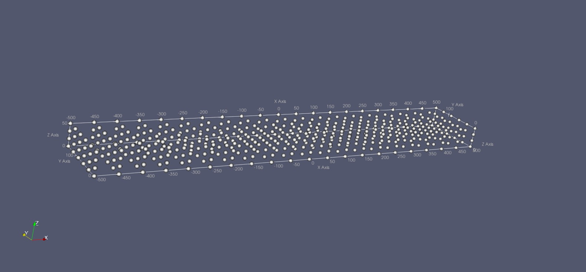

<h1 align="center">Examen Parcial IA</h1>

En este [repositorio](https://github.com/Diegodesantos1/Examen_Parcial_IA) queda resuelto el examen parcial.

<h2 align="center">Método de elementos finitos</h2>

Este código genera los 10 pasos de MEF_beam_bulk que es la aproximación a la estructura de la viga usando métodos numéricos:

Con su visualización usando pyvista:

<h2 align="center">Definiendo la estructura de los nodos</h2>

Este código genera el archivo viga.vtu:

Con su visualización usando vtk:

<h2 align="center">ParaView</h2>

Utilizando la herramienta ParaView he podido ver más en profundidad la estructura de la viga:

